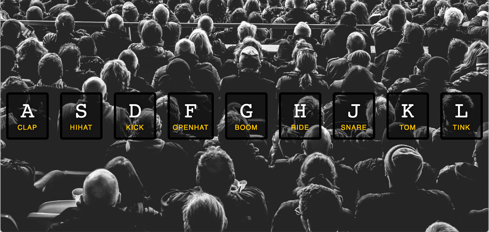

# drum-kit JavaScript 30 Project

A static web page built with HTML, CSS & JavaScript. This project uses .wav audio files and keypress events to turn the user's keyboard into a drum set.

[*live link*](https://anisyapurnama.github.io/JS30-drum-kit/.)

Studying this project I learned about:

- Dynamically setting classes
- Using the tag and .wav assets
- How the query selector can be used to easily interact with many elements
- Reduce complex problems into a series of manageable layers and components.

I struggled with:
- Encapsulating functionality in components. 

